# Macro-Action-Based Multi-Agent Reinforcement Learning

<p align="center">
    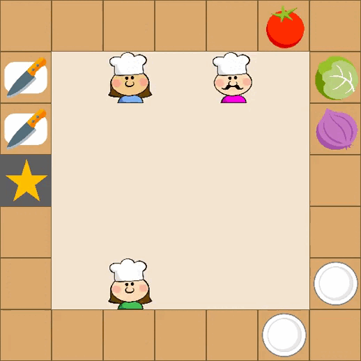</img>
    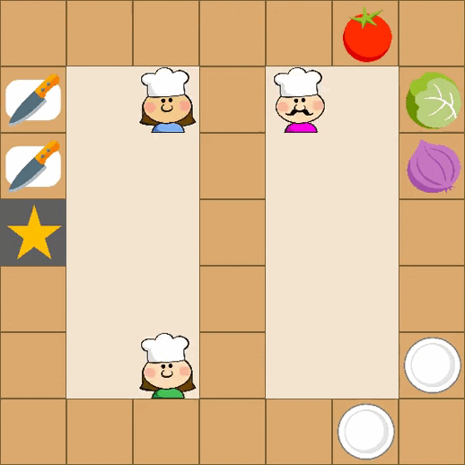</img>
    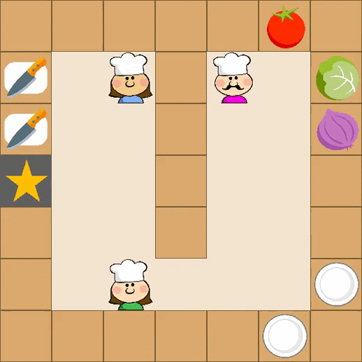</img>
</p>

# Introduction
Adapted from [gym-cooking](https://github.com/rosewang2008/gym-cooking). 

Robots need to learn cooperating with each other to prepare a certain dish according to the recipe and deliver it to the `star' counter cell as soon as possible. The challenge is that the recipe is unknown to robots. Robots have to learn the correct procedure in terms of picking up raw vegetables, chopping, and merging in a plate before delivering.

## Installation

- To install all the dependencies:
  ```
  git clone https://github.com/WeihaoTan/gym-macro-overcooked.git
  cd gym-macro-overcooked/
  pip install -e .
  ```

## Code structure
- `play.py`: a toy for mutual playing the env.

- `./gym_macro_overcooked/overcooked_V1.py`: overcooked env with primitive-actions.

- `./gym_macro_overcooked/overcooked_MA_V1.py`: overcooked env with macro-actions.

- `./gym_macro_overcooked/macActEnvWrapper.py`: a wrapper for the macro-env. Only using when running Overcooked-MA-v1.

- `./gym_macro_overcooked/mac_agent.py`: macro-agents contain macro-information(action, done, status, obs).

- `./gym_macro_overcooked/items.py`: all the entities in the map(agent/food/plate/knife/delivery counter).

- `./gym_macro_overcooked/render`: resources and code for render.

## Usage
### Manual control
```
python play.py
```
Adding the setting you want to play. Eg:
```
python play.py --env_id Overcooked_MA_V1 --n_agent 3 --task 6 --grid_dim 7 7 --map_type A --obs_radius 2
```
Enter the index of the action(primitive/macro) for each agent. The index of each action is listed in the file.  
Eg. When playing Overcooked_MA_V1, entering `1, 2 ,3`. Agent1 go to get tomato. Agent2 go to get lettuce. Agent3 go to get onion.

## Environment
| Map A | Map B | Map C |
|:---:|:---:|:---:|
|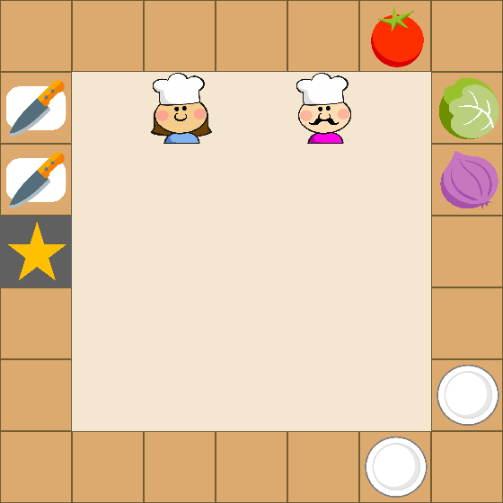</img>  | 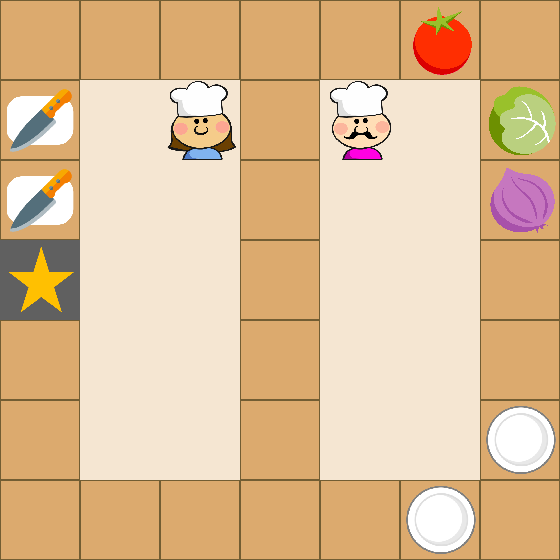</img> | 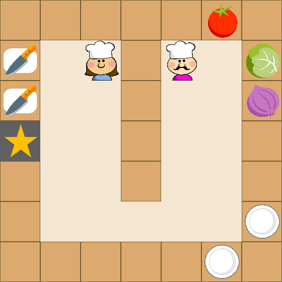</img> |
| 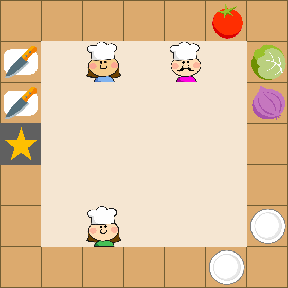</img>  | 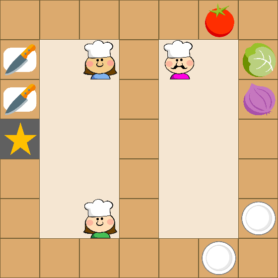</img> | 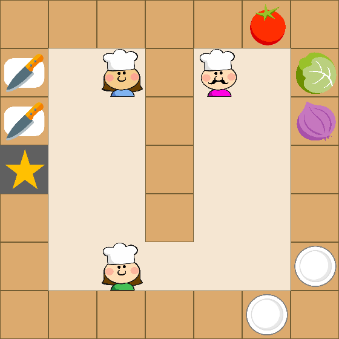</img> |
| 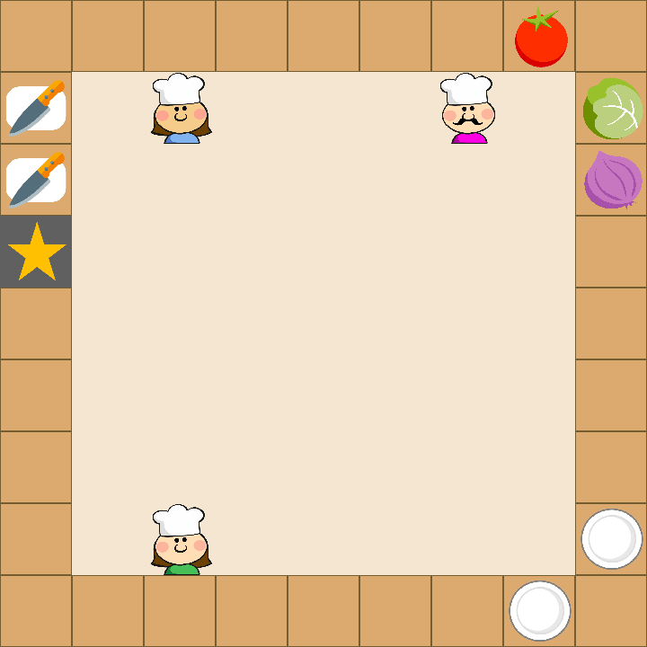</img>  | 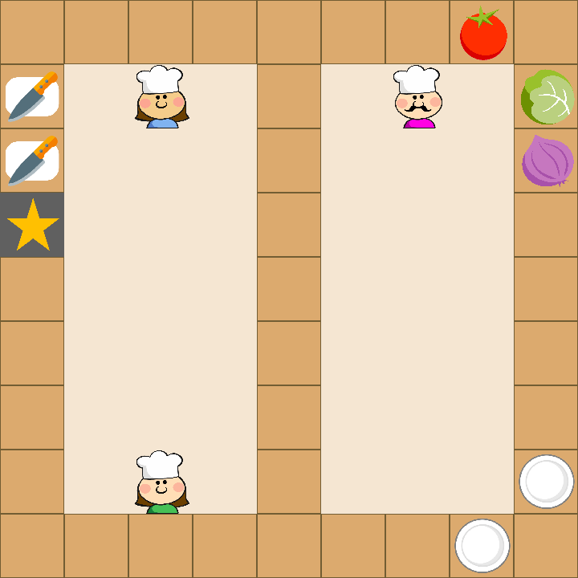</img> | 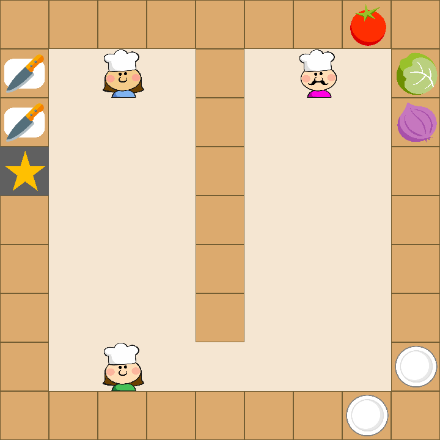</img> |


### Parameters
```
env_id(str): id of the overcooked environment
grid_dim(int, int): grid world size of the map
map_type(str): layout of the map
n_agent(int): number of agents
obs_radius(int): radius of the agents
task(int): receipt agent cooks
mode(str): type of the observation
debug(bool): whehter print the debug information and render
```

- env_id
```
Overcooked-v1: overcooked environment with primitive-actions.
Overcooked-MA-v1: overcooked environment with macro-actions.
```

- grid_dim
```
[7, 7]: the size of the map is 7X7 
[9, 9]: the size of the map is 9X9
```

- map_type
```
A: map A
B: map B
C: map C
```

- n_agent
```
2: two agents in the map
3: three agents in the map
```

- obs_radius
```
0: Each agent can observe all the position and status of the entities in the map.
1: Each agent only observes the position and status of the entities within a 3X3 square  centered on the robot.
2: Each agent only observes the position and status of the entities within a 5X5 square  centered on the robot.
3: Each agent only observes the position and status of the entities within a 7X7 square  centered on the robot.
...
```

|</img> | 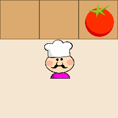</img> | 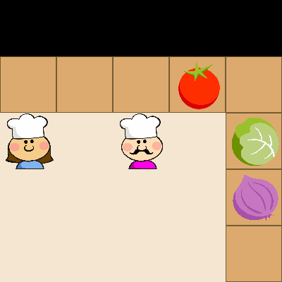</img> | 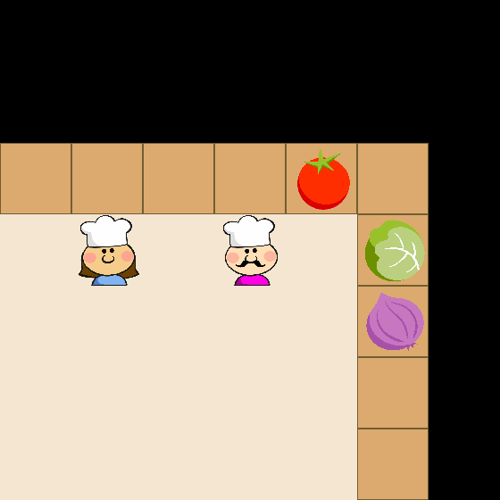</img> |
|:---:|:---:|:---:|:---:|
| obs_radius: 0 | 1 | 2 | 3 |

- task
```
TASKLIST = ["tomato salad", "lettuce salad", "onion salad", "lettuce-tomato salad", "onion-tomato salad", "lettuce-onion salad", "lettuce-onion-tomato salad"]

task :
0 : tomato salad
1 : lettuce salad
2 : onion salad
3 : lettuce-tomato salad
4 : onion-tomato salad
5 : lettuce-onion salad
6 : lettuce-onion-tomato salad
```


|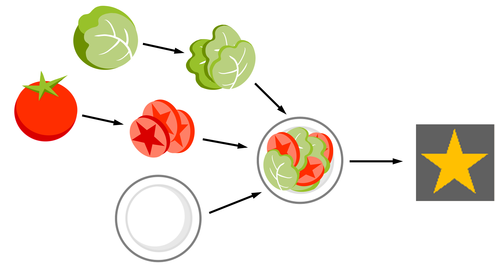</img> | 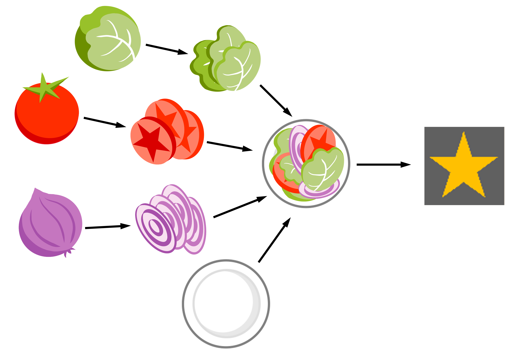</img> | 
|:---:|:---:|
| lettuce-tomato salad | lettuce-onion-tomato salad | 


- mode
```
vector: the observation is returned in vector 
image: the observation is returned in rgb array
```

## Observation
- vector  
```
obs = [tomato.x, tomato.y, tomato.status, lettuce.x, lettuce.y, lettuce.status, onion.x, onion.y, onion.status, plate-1.x, plate-1.y, plate-2.x, plate-2.y, knife-1.x, knife-1.y, knife-2.x, knife-2.y, delivery.x, delivery.y, agent1.x, agent1.y, agent2.x, agent2.y, (agent3.x, agent3.y), onehotTask]  

Agents only observe the positions and status of the entities within obs_radius. The items not observed are masked as 0 in the corresponding dims.
```

- image
```
if obs_radius > 0:
    height, width = 80 * (obs_radius * 2 + 1)
else:
    height, width = 80 * grid_dim
obs_size = [height, width, 3]
```

## Action
- Primitive-action  
right, down, left, up, stay

- Macro-action  
In map A:
stay, get tomato, get lettuce, get onion, get plate 1, get plate 2, go to knife 1, go to knife 2, deliver, chop, right, down, left, up  
In map B/C: stay, get tomato, get lettuce, get onion, get plate 1, get plate 2, go to knife 1, go to knife 2, deliver, chop, go to counter, right, down, left, up

## Reward
- +10 for chopping a correct vegetable into pieces  
- +200 terminal reward for delivering the correct dish  
- −5 for delivering any wrong dish  
- −0.1 for every timestep  

## Termination
Env terminates when the correct dish is delivered.

## Extention
The values of reward can be changed in rewardList. Users can add new map of different layout by adding map in overcooked_V1.py. The new map is allowed to change the position of entities or delete any entities. Adding new entities is not supported.

## Citations
If you are using MacroMARL in your research, please cite the corresponding papers listed below:
```
@InProceedings{xiao_neurips_2022,
  author = "Xiao, Yuchen and Wei, Tan and Amato, Christopher",
  title = "Asynchronous Actor-Critic for Multi-Agent Reinforcement Learning",
  booktitle = "Proceedings of the Thirty-Sixth Conference on Neural Information Processing Systems (NeurIPS)",
  year = "2022"
}
```

